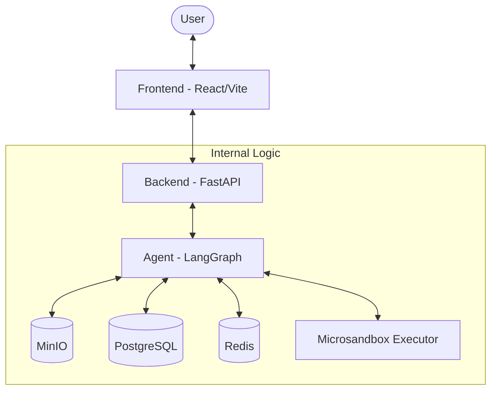
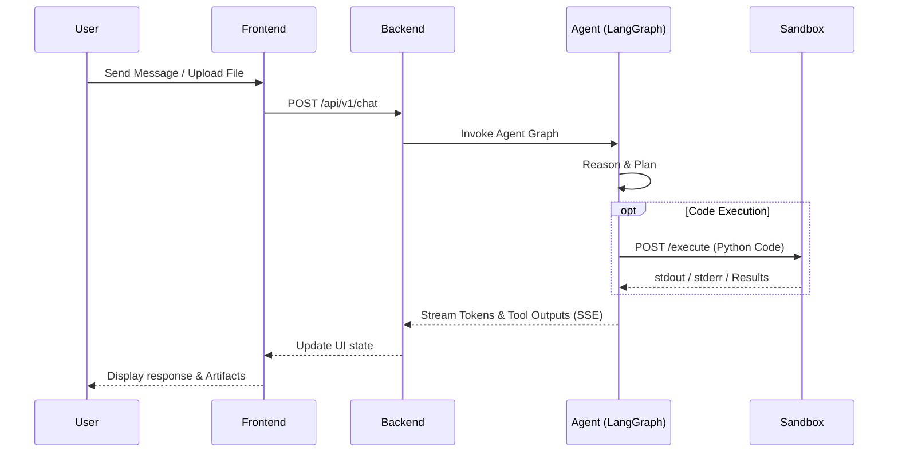

# DeepAgent Sandbox

An advanced agentic data analysis platform that combines LLM reasoning with isolated code execution to transform data, generate visualizations, and produce detailed reports.

## Architecture Overview

DeepAgent Sandbox is built as a distributed system comprising a React-based frontend, a FastAPI backend orchestrating LangGraph workflows, and an isolated microVM-backed execution layer.



The backend manages the agent's state using LangGraph, providing durable execution, resumability, and real-time streaming via Server-Sent Events (SSE).

## Key Features

- **Isolated Code Execution**: Securely run agent-generated Python code in microVM-backed sandboxes via `microsandbox`.
- **Durable Workflows**: Resumable agent threads powered by LangGraph persistence in PostgreSQL.
- **Real-time Streaming**: Instant feedback on agent reasoning and tool execution using SSE.
- **Artifact Management**: Automatic storage and retrieval of generated CSVs, PNGs, and reports in MinIO.
- **Thread History**: Full persistence of chat history and agent state for long-running analyses.

## Tech Stack

| Component | Technology |
| :--- | :--- |
| **Frontend** | React, TypeScript, Vite, Tailwind CSS, shadcn/ui |
| **Backend** | Python 3.12+, FastAPI, LangGraph, Pydantic |
| **Agent Harness** | DeepAgents (LangChain) |
| **Execution Layer** | Microsandbox (microVMs) |
| **Database** | PostgreSQL (Metadata & Checkpoints) |
| **Cache/PubSub** | Redis |
| **Object Storage** | MinIO (S3 Compatible) |

## Project Structure

```text
.
├── backend/                # FastAPI application & LangGraph logic
│   ├── app/
│   │   ├── agent/          # Agent graph, models, and tools
│   │   ├── api/            # API routes (chat, files, threads)
│   │   ├── db/             # Database schemas & repositories
│   │   └── storage/        # Storage service integration (MinIO)
│   └── tests/              # Backend test suite
├── frontend/               # React/Vite frontend application
│   ├── src/
│   │   ├── components/     # UI components (shadcn/ui)
│   │   ├── store/          # Frontend state management
│   │   └── types/          # TypeScript definitions
├── microsandbox-executor/  # Isolated execution control plane
├── docker-compose.yml      # Infrastructure orchestration
└── justfile                # Project command orchestration
```

## Logic Flows

The following diagram illustrates the lifecycle of a user request from message submission to code execution and response streaming.



## Installation & Setup

### Prerequisites

- [Docker & Docker Compose](https://www.docker.com/)
- [just](https://github.com/casey/just) (command runner)
- [uv](https://github.com/astral-sh/uv) (Python package manager)
- [pnpm](https://pnpm.io/) (Node package manager)

### Quick Start

1. **Clone and Setup Environment**:
   ```bash
   cp .env.example .env
   ```

2. **Initialize Infrastructure**:
   ```bash
   just up
   ```

3. **Install Dependencies**:
   ```bash
   just setup
   ```

4. **Start the Application**:
   ```bash
   just start
   ```

The application will be available at:
- **Frontend**: `http://localhost:5173`
- **Backend API**: `http://localhost:8000/docs`
- **MinIO Console**: `http://localhost:9001`

## Usage Examples

### Data Analysis Request
**User:** "Analyze `sales_2023.csv` and show me the monthly revenue trend."

**Agent Action:**
1. Loads file from MinIO workspace.
2. Generates Python code using `pandas` and `matplotlib`.
3. Executes code in the isolated sandbox.
4. Returns a trend analysis text and a generated `revenue_trend.png` artifact.

## References

- [DeepAgents](https://github.com/langchain-ai/deepagents): Professional agent harness.
- [microsandbox](https://github.com/superradcompany/microsandbox): MicroVM isolation layer.
- [Project Plan](implementation_plan.md): Detailed roadmap and technical design.
