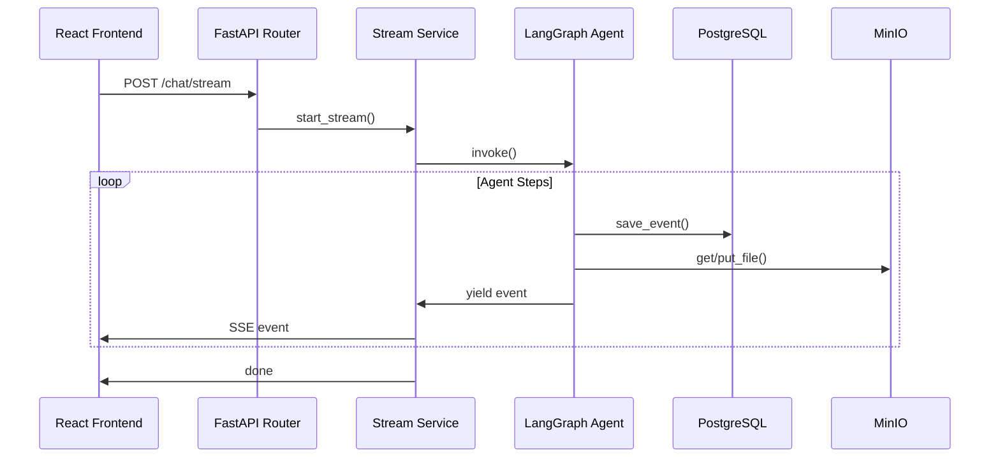

# Backend Architecture

The backend is built with FastAPI and follows a layered architecture to separate concerns and ensure maintainability.

## Layered Structure

1. **API Layer (`app.api`)**: FastAPI routers, dependency injection, and endpoint definitions.
2. **Service Layer (`app.services`)**: Orchestrates business logic, integrates multiple repositories, and handles external service calls (e.g., MinIO, Executor).
3. **Agent Layer (`app.agent`)**: Contains the LangGraph definition, agent backend implementation, and tool configurations.
4. **Data Access Layer (`app.db`)**: SQLAlchemy models and repositories for interacting with PostgreSQL.
5. **Storage Layer (`app.storage`)**: Wrappers for MinIO object storage.

## Request Flow

## Dependency Injection

The backend makes extensive use of FastAPI's `Depends` for:
- Retrieving settings (`get_settings`).
- Injecting database sessions (`get_db_session`).
- Accessing service instances (`get_message_service`, `get_run_service`, etc.).
- Authentication and user validation.

## Agent Integration

The core logic is powered by `LangGraph` and a custom `MicrosandboxBackend`.
- **`graph.py`**: Defines the state machine and nodes of the agent.
- **`backend.py`**: Implements the bridge between the agent framework and the project's services (database, storage, executor).
- **`tools.py`**: Defines the capabilities available to the agent (e.g., executing Python code, searching files).
