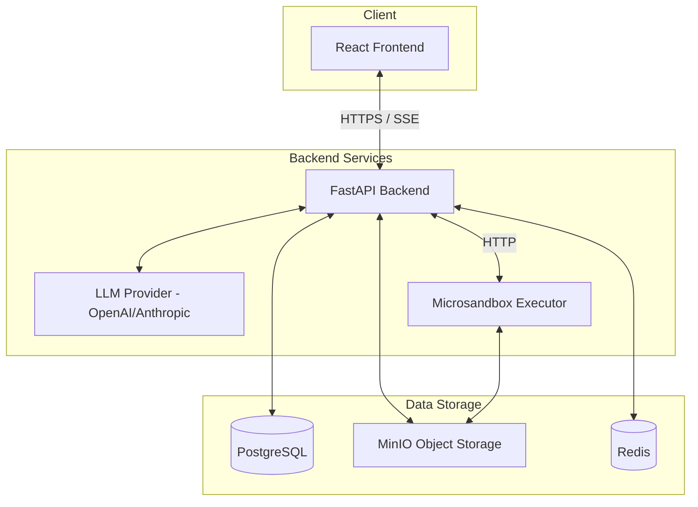

# System Architecture Overview

The DeepAgent Sandbox is designed as a distributed system focusing on secure agent-driven code execution and real-time user feedback.

## High-Level Diagram

## Core Components

### 1. React Frontend
- **Responsibilities**: User interface, chat management, file visualization, real-time stream processing.
- **Tech Stack**: TS, Vite, shadcn/ui, Zustand, React Query.

### 2. FastAPI Backend
- **Responsibilities**: API orchestration, agent logic (LangGraph), session management, file presigning, task scheduling.
- **Tech Stack**: Python, FastAPI, SQLAlchemy, Pydantic, DeepAgents Framework.

### 3. Microsandbox Executor
- **Responsibilities**: Isolated code execution, data processing, artifact generation.
- **Isolation**: Runs in a dedicated Docker container with limited resources and restricted access.

## Data Mutation Lifecycle

1. **User Request**: User sends a message via the UI.
2. **Backend Orchestration**: FastAPI receives the message and triggers a LangGraph run.
3. **Agent Logic**: The agent decides which tools to call (e.g., Python execution).
4. **Sandbox Execution**: Tool calls are forwarded to the `microsandbox-executor`.
5. **Result Retrieval**: Results (text, charts, files) are returned to the backend.
6. **Streaming Response**: Backend streams events back to the UI via Server-Sent Events (SSE).
7. **Persistence**: All messages, events, and file metadata are stored in PostgreSQL. Physical files are stored in MinIO.
